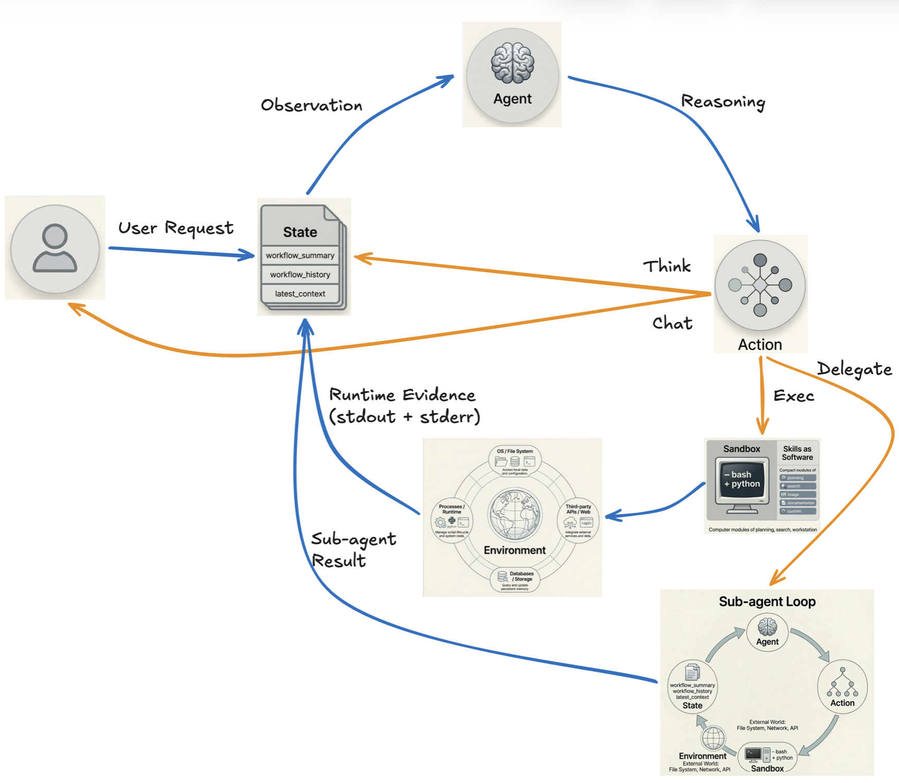

# OpenHelix

**An open, transparent, fully-local agentic system that evolves with you.**

OpenHelix gives an LLM a real computer — a host-shell sandbox where it writes and runs bash and python to get things done, gated by an approval prompt you answer in the loop. Everything runs locally by default; no data leaves your machine unless you choose to connect a hosted LLM. The agent learns over time by creating reusable skills and documenting knowledge as it works.

## Highlights

- **Local by default.** Runs on a local LLM out of the box; any OpenAI-compatible endpoint also works. Web search and media generation are local services you opt into when you need them.
- **Fully transparent.** Inspect the conversation, the system prompt, the skills the agent has, the knowledge library, and the exact text sent to the LLM at any moment. Nothing is hidden.
- **Extensible through skills.** A skill is a `SKILL.md` file the agent reads and follows — no code required for most. For complex tasks, add scripts alongside. The agent creates new skills when it discovers reusable patterns.
- **Self-evolving.** The agent documents what it learns into a hierarchical knowledge library — global index → category catalog → document. No vector DBs, no embeddings; everything is plain markdown you can read.

## The Control Law

Everything follows one loop:

```
state → agent → action → environment → state
```



The LLM is the **Agent**. The host-shell sandbox is its computer — the hands that affect the **Environment**, with an approval gate you control. **Skills** are reusable procedures. **Knowledge** is documented experience. Every step is grounded by real stdout/stderr evidence from execution.

## Quick Start

### 1. Install

```bash
pip install -e .
```

Requires Python 3.10+.

### 2. Run your first session

The fastest path is a local LLM via Ollama:

```bash
# One-time: pull a small local model
ollama serve && ollama pull llama3.1:8b

# Start OpenHelix
helix \
  --endpoint-url http://localhost:11434/v1 \
  --model llama3.1:8b \
  --workspace ~/agent \
  --session-id my-first-session
```

You land in an interactive prompt. Type a task in plain English; the agent will plan and execute it. Type `/help` for commands, `/exit` to quit.

**Approval mode.** Every session starts in *controlled* mode — the agent pauses for your approval before every bash/python execution. The prompt shows the job name, the script, and a menu of choices. Pick `a` at any prompt to switch the session to *auto* mode and stop being asked. You can also flip mode at the REPL with `/mode auto` or `/mode controlled`. Mode is intentionally not persisted across restarts; every session starts safe-by-default.

### 3. Use a hosted LLM instead

Any OpenAI-compatible endpoint works:

```bash
helix \
  --endpoint-url https://api.deepseek.com/v1 \
  --api-key $DEEPSEEK_API_KEY \
  --model deepseek-chat \
  --workspace ~/agent \
  --session-id research-01
```

### 4. Add local services (optional)

OpenHelix bundles two local services that unlock additional capabilities:

```bash
# Local web search (used by the search-online-context skill)
helix start searxng

# Local image / audio / video generation
helix start local-model-service
helix model download --skill generate-image
helix model download --skill generate-audio
helix model download --skill generate-video
```

`helix model download` fetches model weights from [HuggingFace Hub](https://huggingface.co). Each generative skill's `model_spec.json` points at a HuggingFace repo slug. Set `HF_TOKEN` in your environment first if a model is gated or private.

## How the agent solves a task

The runtime loop above is the *mechanic* — what happens on every turn. The *strategy* — what the agent does across turns to actually solve a task — is a seven-step procedure baked into the system prompt:

1. **Understand** the request.
2. **Gather context** — check existing skills, knowledge, and workspace state.
3. **Plan** the approach.
4. **Act** — prefer existing skills; write inline scripts when no skill fits.
5. **Verify** the results.
6. **Reflect** — if the session produced something reusable, create a skill or knowledge document before returning control.
7. **Report** the outcome to you via `chat`.

Each step is one or more iterations of the loop. You can audit the exact text governing the agent at any moment with `/view last_prompt`.

**Inspectability.** `/view observation` shows the recent turn trace. `/view workflow_summary` shows the compacted long-term memory. `/status` shows the session config. Session state is saved automatically — restart with the same `--session-id` to resume.

## Built-in Skills

### Knowledge & planning

| Skill | Purpose |
|---|---|
| `retrieve-knowledge` | Search and load knowledge documents |
| `create-document` | Create a knowledge document |
| `update-document` | Update a knowledge document |
| `file-based-planning` | File-based task planning |
| `brainstorming` | Structured ideation and design |

### Skill authoring

| Skill | Purpose |
|---|---|
| `create-skill` | Create a new procedural skill (SKILL.md + optional scripts) |
| `update-skill` | Update an existing procedural skill |
| `create-generative-skill` | Create a new ML-backed skill (model_spec + host adapter + scripts) |
| `update-generative-skill` | Update an existing generative skill |

### Web & media generation

| Skill | Purpose |
|---|---|
| `search-online-context` | Search the web via SearXNG |
| `analyze-image` | Analyze images via an Ollama vision model |
| `generate-image` | Text-to-image (local MLX, Z-Image) |
| `generate-audio` | Text-to-speech (local PyTorch, Qwen3-TTS) |
| `generate-video` | Text-to-video and image-to-video (local MLX, LTX-2.3) |

## CLI Reference

| Command | Purpose |
|---|---|
| `helix --endpoint-url URL --model MODEL --workspace PATH --session-id ID [flags]` | Start a session |
| `helix start searxng` | Start the SearXNG search service |
| `helix start local-model-service` | Start the local model service |
| `helix stop searxng \| local-model-service` | Stop a running service |
| `helix status` | Show running services |
| `helix model download --skill NAME` | Download model weights for a media-generation skill |

### Optional flags for `helix`

`--think` and `--effort` shape how hard the model reasons. Both are optional and independent; omit either to fall back to the server's default.

- **`--think enable|disable`** — binary thinking-mode toggle. Maps to the three common OpenAI-compatible field conventions so a single flag works across servers: `thinking.type` (DeepSeek, Z.ai/GLM), `think` (Ollama), and `chat_template_kwargs.enable_thinking` (vLLM/SGLang Qwen3). Providers that don't recognize a field ignore it.
- **`--effort minimal|low|medium|high`** — reasoning-effort level, forwarded as `reasoning_effort`. Recognized by OpenAI (GPT-5/o-series), DeepSeek, and Gemini's OpenAI-compatible endpoint. Ignored by providers that don't support effort levels.

Example — DeepSeek with thinking enabled at medium effort:

```bash
helix \
  --endpoint-url https://api.deepseek.com/v1 \
  --api-key $DEEPSEEK_API_KEY \
  --model deepseek-chat \
  --think enable --effort medium \
  --workspace ~/agent --session-id research-01
```

## Runtime Commands

| Command | Purpose |
|---|---|
| `/help` | Show all commands |
| `/status` | Show the session configuration |
| `/mode` / `/mode auto\|controlled` | Show or switch the approval mode for this session |
| `/view <field>` | Inspect core-agent state: `full_history`, `observation`, `workflow_summary`, or `last_prompt` |
| `/view sub_agents` | List sub-agents created in this session |
| `/view <field> <role>` | Inspect a specific sub-agent's state by role |
| `/exit` | Quit |

Sub-agents are spawned when the core-agent chooses a `delegate` action. Each sub-agent persists its full history, observation window, workflow summary, and last prompt across delegations to the same role, so you can drill into exactly what the sub-agent saw on any past turn.

## Documentation

- [Introduction](docs/introduction.md) — core concepts and design philosophy
- [Quick Start](docs/quickstart.md) — detailed first session walkthrough
- [Skills](docs/skills.md) — built-in skills, and how to create your own
- [Knowledge](docs/knowledge.md) — the hierarchical knowledge system
- [Storage](docs/storage.md) — workspace and global file layout
